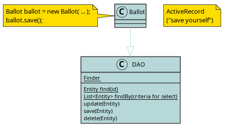

# Custom PlantUML Themes

This repository contains custom PlantUML themes, because the default one leaves something to be desired.

Include them in your UML scripts thus:

```
@startuml
!includeurl https://raw.githubusercontent.com/catando/plantuml-themes/master/themes/branded-sea.pu
...
```

# Sample output





# Contributing

Fork and add your enhancements.

To render the examples, make sure Docker is running on your computer and run `make`. This workflow assumes you use a unix-based operating system, like Linux or MacOS; you will need to make adjustments if you are using Windows.
